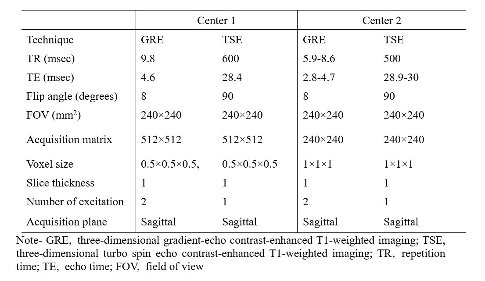
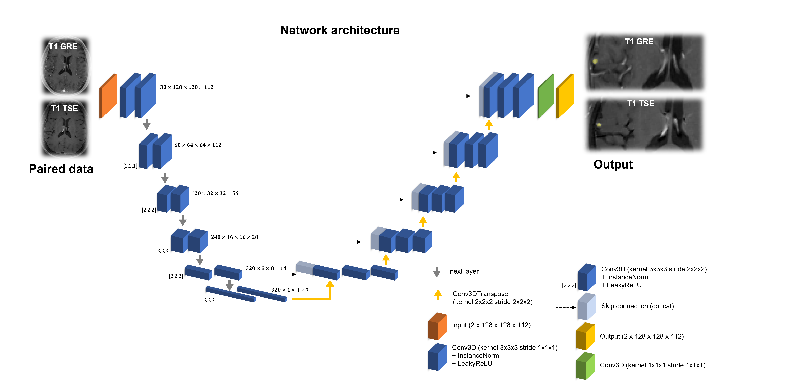

# Brain Metastasis Detection
Deep learning-based Metastasis Detection to Enhance Reproducibility and Reduce Workload in Brain Metastasis Screening with MRI: A Multi-center Simulation Study

**Summary statement**
- Deep learning-based detection of brain metastasis has the potential to result in a more reproducible and standardized assessment and reduce reading time.

**Key results**
-	Our deep  learning-based system exhibited a robust detection **sensitivity of 90.2%** and **positive predictive value of 88.2%**, with multi-center validation.
-	Agreement among readers regarding the number of metastases detected was greater with the deep-learning system than without it (**limits of agreement, −0.281 vs. −0.163**).
-	The reading time was significantly reduced from mean **66.9 s to 57.3 s** with the deep-learning system, regardless of the imaging center.

## Table of Contents
- [Brain Metastasis Detection](#brain-metastasis-detection)
- [Table of Contents](#table-of-contents)
- [MRI Acquisition Protocol](#mri-acquisition-protocol)
- [Network Architecture](#network-architecture)
- [Installation](#installation)
- [Usage](#usage)
- [Acknowledgements](#acknowledgements)

## MRI Acquisition Protocol
### AMC (Asan Medical Center)
The imaging parameters for the GRE-T1WI sequence were as follows: repetition time (TR)/echo time (TE), 9.8/4.6 ms; flip angle, 8°; field of view, 24 cm; section thickness, 1 mm; matrix, 1024 × 1024; and acquisition time, 2 minutes 58 s. The parameters for the fast spin-echo sequence were as follows: TR/TE, 600/28.4 ms; flip angle, 90°; field of view, 24 cm; section thickness, 1 mm; matrix, 512 × 512; and acquisition time, 3 minutes 33 s. The improved motion-sensitized driven-equilibrium pre-pulse consisted of one 90° excitation pulse, two 180° refocusing pulses, and one 90° excitation pulse with motion-sensitized gradients between radiofrequency pulses. The duration between the two 90° pulses (TEprep) was 28.3 ms, and the flow velocity encoding for gradient pulses was 3 cm/s.

### Severance hospital
The parameters for the fast spin-echo sequence were as follows: TR/TE, 600/28.4 ms; flip angle, 90°; field of view, 24 cm; section thickness, 1 mm; matrix, 240 × 240; and acquisition time, 3 minutes 23 s. The improved motion-sensitized driven-equilibrium pre-pulse consisted of one 90° excitation pulse, two 180° refocusing pulses, and one 90° excitation pulse with motion-sensitized gradients between radiofrequency pulses. The duration between the two 90° pulses (TEprep) was 28.3 ms, and the flow velocity encoding for gradient pulses was 1.3 cm/s. The imaging parameters for the GRE-T1WI sequence were as follows: repetition time (TR)/echo time (TE), 5.9-8.6/2.8-4.7 ms; flip angle, 8°; field of view, 24 cm; section thickness, 1 mm; matrix, 240 × 240; and acquisition time, 3 minutes 2 s.

### Table 1
Imaging parameters of 3D CET1WI sequence of two centers


## Network Architecture
Network architecture of the deep learning system for detection and count of brain metastasis. The trained U-Net architecture and more detailed information such as feature map size, kernel, and strides. Since the input image size varies for each case, several patches are generated using a sliding window approach. Model prediction results for each patch overlap by half of the size of a patch and are aggregated to generate the final lesion mask.



For more information about [nnU-Net](https://github.com/MIC-DKFZ/nnUNet), please read the following paper:


    Isensee, F., Jaeger, P. F., Kohl, S. A., Petersen, J., & Maier-Hein, K. H. (2020). nnU-Net: a self-configuring method 
    for deep learning-based biomedical image segmentation. Nature Methods, 1-9.
    
## Installation
Installed requirements can cause potential conflicts with your library. Therefore, we recommend that you configure the virtual environment to run the following process.

This program has been confirmed to work in **Ubuntu 18.04 and 20.04**. [CUDA](https://developer.nvidia.com/cuda-toolkit-archive) and [cuDNN](https://developer.nvidia.com/cudnn) are required prior to installation.

1. This program was written using Python 3. Check your Python version.
2. Install [PyTorch](https://pytorch.org/get-started/locally) as described on their website (conda/pip).
3. Verify that a recent version of pytorch was installed by running


    ```bash
    python -c 'import torch;print(torch.backends.cudnn.version())'
    python -c 'import torch;print(torch.__version__)'   
    ```

    This should print 8200 and 1.11.0+cu113 (Apr 1st 2022)

4. Install nnU-Net

    ```bash
    git clone https://github.com/jieunp/BM_detection_AI.git
    cd BM_detection_AI
    pip install -r requirements.txt
    pip install -e .
    ```
    
5. Your 3D brain MR image data should be prepared in the following structure. The prefix means a unique idnetifier, such as the number of the sample, and the suffix after the underbar means a **black blood image for 0000** and a **T1 contrast enhanced image for 0001**. All data must be in nifti (`*.nii`) format. A segmentation mask named only with a prefix is automatically extracted to the folder specified as the `output` folder.
    
        BM_detection_AI/
        ├── dataset
        │   ├── Patient_A_0000.nii   <- Black Blood image
        │   ├── Patient_A_0001.nii   <- T1 Contrast Enhanced image
        │   ├── Patient_B_0000.nii
        │   └── Patient_B_0001.nii
        └── output
            ├── Patient_A.nii        <- Segmentation mask
            └── Patient_B.nii

6. Download the model `best.model` file through the following [download](https://drive.google.com/file/d/1w7N0z901rAzuC6I7AarVbNE7c5DZyQjk/view), and move it to `BM_detection_AI/results/nnUNet/3d_fullres/meta/nnUNetTrainer__nnUNetPlans/all`.

## Usage
Detect metastasis by running `predict_simple.py`.
`-i` is the input dataset folder name and `-o` is the folder name to export segmentation mask.

    python nnunet/inference/predict_simple.py -i dataset -o output -t meta -tr nnUNetTrainer -m 3d_fullres -f all
    
## Acknowledgements
This code borrows from
- [MIC-DKFZ/nnUNet](https://github.com/MIC-DKFZ/nnUNet)
